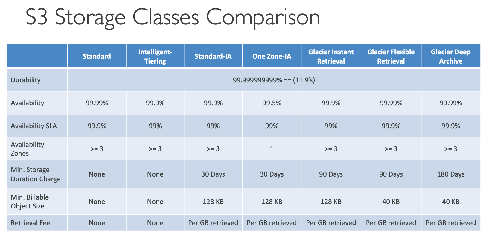

# Section 8. Amazon S3

## 1. S3 (Simple Storage Service)

- Infinitely scalable object storage.
- Buckets
  - Store objects (files) in buckets.
  - Bucket names must be unique globally.
  - Buckets are defined at the region level.
- Objects
  - Objects are files.
  - Objects have a key (name) and data.

## 2. S3 Security

- User based
  - IAM policies - which API calls should be allowed for a specific user from IAM console.
- Resource based
  - Bucket policies - bucket wide rules from S3 console.
  - Object access control list (ACL) - finer grain.
  - Bucket access control list (ACL) - less common.
- Encryption
- Bucket Policies
  - JSON based policies.
  - Resources: buckets and objects.
  - Actions: Set of API to Allow or Deny.
  - Effect: Allow/Deny.
  - Principal: The account or user to apply the policy to.

## 3. S3 Static Website Hosting

- S3 can host static websites and have them accessible on the www.
- The website URL will be:
  - `<bucket-name>.s3-website-<AWS-region>.amazonaws.com`

## 4. S3 Versioning

- Stores all versions of an object (including all writes and even if you delete an object).

## 5. S3 Replication (CRR & SRR)

- Cross Region Replication (CRR)
  - Compliance, lower latency access, replication across accounts.
- Same Region Replication (SRR)
  - Log aggregation, live replication between production and test accounts.

## 6. S3 Storage Classes

- Durability vs Availability

  - Durability: 99.999999999% (11 9s) of objects are durable.
  - Availability: 99.99% availability for S3. (Not available 53 minutes per year)

- S3 Standard - General Purpose
  - Used for frequently accessed data.
  - Low latency and high throughput.
- S3 Standard - Infrequent Access (IA)
  - Data that is accessed less frequently, but requires rapid access when needed.
  - Lower cost compared to S3 Standard.
- S3 One Zone - Infrequent Access
  - Same as IA, but data is stored in a single AZ.
  - Lower cost compared to IA.
- S3 Intelligent Tiering
  - Uses ML to move objects between tiers.
  - Designed for unknown or changing access patterns.
- S3 Glacier (S3 G)
  - Low cost object storage meant for archiving/backup.
  - Instant retrieval, Flexible retrieval, Deep Archive
- S3 Intelligent Tiering
  - Small monthly monitoring and auto-tiering fee.
  - Automatically moves objects between two access tiers based on changing access patterns.

## 7. Snow Family
- Highly secure, portable devices to collect and process data at the edge, and migrate data into and out of AWS.
- Solutions: Snowcone, Snowmobile, and Snowball Edge.
- Edge computing: Process data while it is being collected.
- AWS OpsHub: A management tool for Snow Family devices.

## 8. Storage Gateway
- Hybrid storage service that enables on-premises applications to seamlessly use AWS cloud storage.