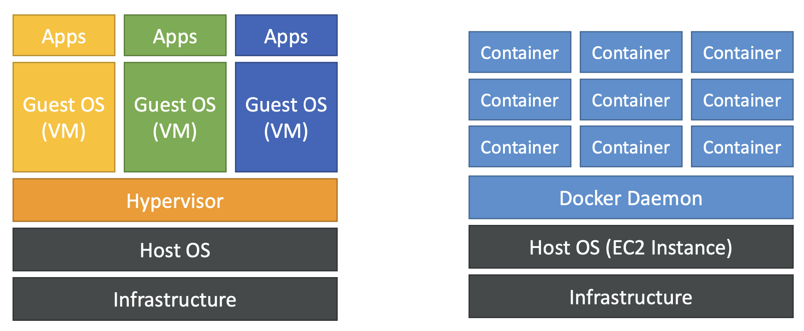

# Section 10. Other Compute Section

## 1. Docker

- A software development platform to deploy apps
- Docker is a tool designed to make it easier to create, deploy, and run applications by using containers
- "Docker vs Virtual Machine"
  - Resources are shared with the host
    

## 2. ECS (Elastic Container Service)

- User must provision & maintain the infrastructure
- Has integrations with the Application Load Balancer.

## 3. Fargate

- User do not provision & maintain the infrastructure.
- Serverless offering (do not need to manage / provision / see servers)

## 4. ECR (Elastic Container Registry)

- For storing Docker images.

## 5. AWS Lambda

- Virtual functions (event driven)
- Used for CRON job.
- Cheap

## 6. Amazon API Gateway

- Fully managed service for developers to easily create, publish, maintain, monitor, and secure APIs.
- Serverless and scalable.

## 7. AWS Batch

- Fully managed batch processing at any scale.
- Batch dynamically launches EC2 instances or Spot Instances.
- Batch jobs are defined as Docker images and run on ECS

## 8. Lightsail

- Virtual servers, storage, databases, and networking
- Simpler alternative to using EC2, RDS, ELB, EBS, Route 53.
- Great for people with little cloud experience.
- Has high availability but no auto-scaling, limited AWS integrations.