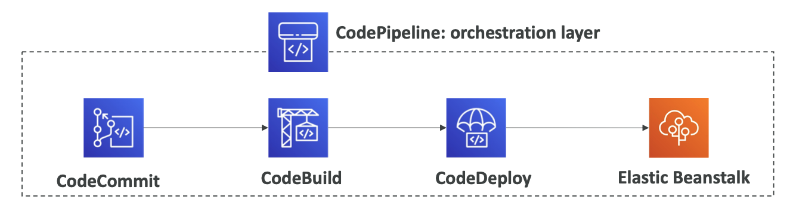

# Section 11. Deployments & Managing Infrastructure at Scale

## 1. CloudFormation

- Infrastructure as Code (IaC)
- Declarative way of outlining AWS Infrastructure, for any resources (most of them are supported).
- Updates are supported.
- CDK (Cloud Development Kit)
  - Define cloud infrastructure using familiar programming languages.
  - Supports TypeScript, JavaScript, Python, Java, C#, etc.

## 2. Elastic Beanstalk

- Managed service to deploy web applications (platform as a service).
- Handles deployment details, capacity provisioning, load balancing, auto-scaling, and application health monitoring.
- Beanstalk = EC2 + ELB + ASG
- Free but you pay for the underlying instances.
- Great for developers who want to quickly deploy their application without worrying about infrastructure.

## 3. CodeDeploy, CodeCommit, CodeBuild, CodePipeline, CodeArtifact, CodeStar, Cloud9

- CodeDeploy
  - Deploy applications automatically to many EC2 instances.
  - Works for EC2 instances, on-premise instances, and Lambda functions.
- CodeCommit
  - Store code in private Git repositories.
  - Fully managed, secure, and scalable.
- CodeBuild
  - Compile source code, run tests, and produce software packages.
  - Fully managed, serverless, and scalable.
- CodePipelines
  - Create CI/CD (Continuous Integration / Continuous Delivery) pipelines and automate releases.
  - Fast and reliable.
  - Works with CodeCommit, CodeBuild, CodeDeploy, Elastic Beanstalk, Lambda, CloudFormation, etc.
    
- CodeArtifact
  - Store and share packages across organizations.
  - Fully managed, secure, and scalable.
- CodeStar (All-in-one)
  - Integrated solution to develop, build, and deploy applications.
  - Uses all the services above.
  - Provides a dashboard to manage everything.
- Cloud9
  - Cloud IDE (Integrated Development Environment).
  - Write, run, and debug code using a browser.
  - Comes with pre-installed SDKs and pre-authenticated to AWS services.
  - Collaborate with others in real-time.

## 4. Systems Manager (SSM)

- Helps you manage your EC2 and on-premise systems at scale.
- Helps install software, patch, collect software inventory, configure operating systems at scale.
- Helps you automate tasks using **Run Command** or **State Manager**.
- Session Manager
  - Get shell access to EC2 instances, without needing SSH.
  - Central logging, fully auditable.
  - No need to open SSH ports.
- Parameter Store
  - Store configuration information and secrets.
    - Version tracking of configurations/secrets.
  - Configuration management using path and IAM.
  - Integration with CloudFormation.
