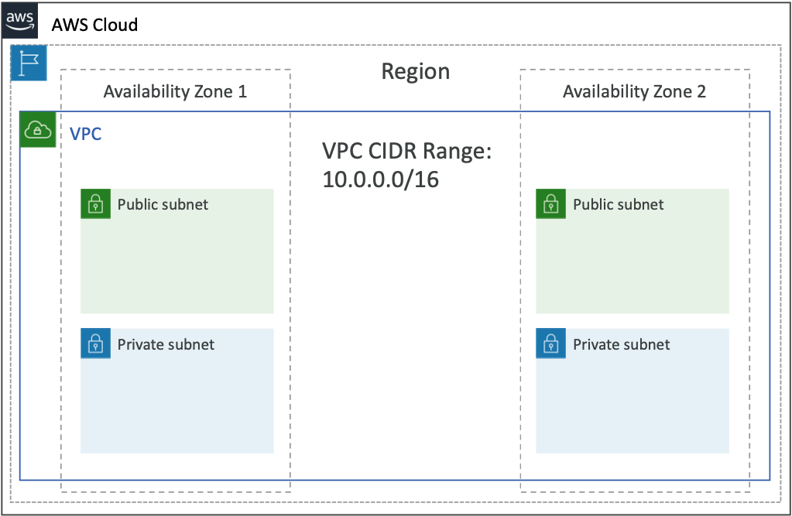
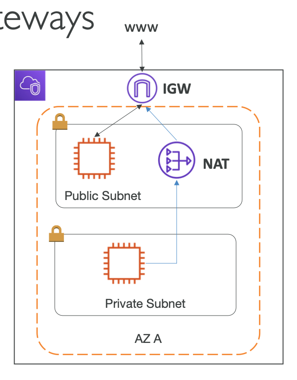
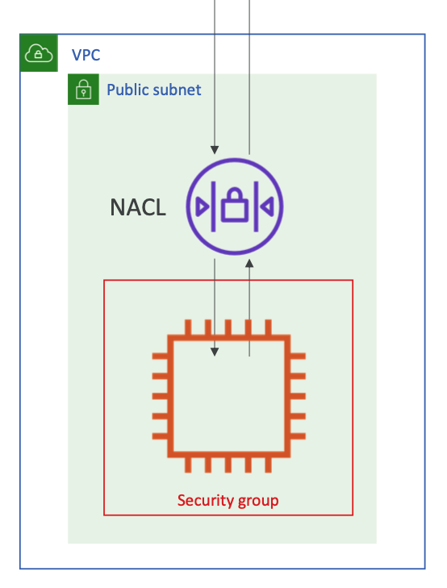
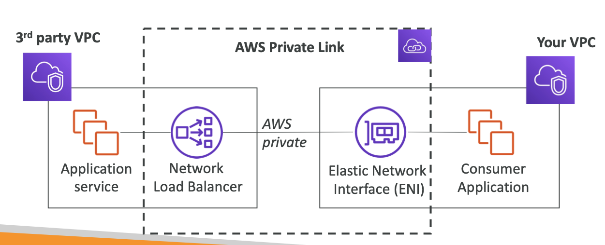
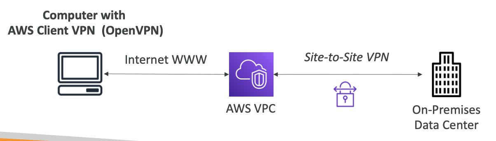
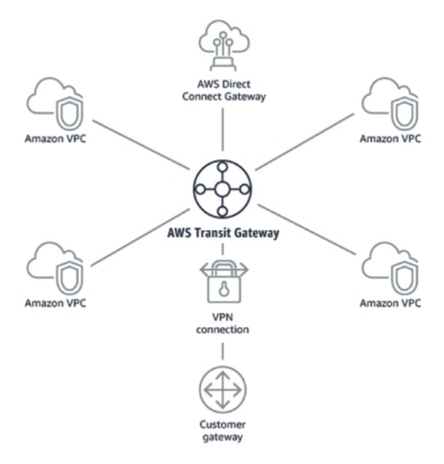

# Section 15. VPC & Networking

## 1. VPC (Virtual Private Cloud)

- VPC: Private network to deploy resources (EC2, RDS, etc.)
- Subnets: Network partition of VPC & tied to AZ
- VPC Diagram:
  
- Internet Gateway: Allow internet access to VPC
- NAT Gateway: Allow internet access from private subnets
- Internet Gateway & NAT Gateway:
  

## 2. Security Groups & NACLs

- Security Groups: Firewall at the EC2 instance level (stateful, allow rules only)
- NACLs: Firewall at the subnet level (stateless, allow & deny rules)
- Security Groups & NACLs:
  

## 3. VPC Flow Logs

- VPC Flow Logs: Capture information about IP traffic going into your interfaces.
- Data goes to CloudWatch Logs or S3.

## 4. VPC Peering

- VPC Peering: Connect two VPCs privately using AWS network. (non-transitive, non-overlapping CIDR)

## 5. VPC Endpoints

- VPC Endpoints: Connect to AWS services using private network (S3, DynamoDB, etc.)
- Provides enhanced security & lower latency to access AWS services.

- VPC Endpoint Gateway: S3 & DynamoDB
- VPC Endpoint Interface: The rest of AWS services

## 6. AWS PrivateLink

- AWS PrivateLink: Most secure way to connect to services (VPC Endpoint Interface)
- Requires a Network Load Balancer (NLB) inside your VPC.
- AWS PrivateLink:
  

## 7. Site-to-Site VPN & Direct Connect (DX)

- Site-to-Site VPN: Connect on-premise to AWS using VPN (public internet, fast to setup, encrypted)
- Direct Connect (DX): Connect on-premise to AWS using dedicated line (private, high bandwidth, more secure, expensive)

## 8. VPC Client VPN

- VPC Client VPN: Connect from computer to AWS using VPN (OpenVPN)
- Allow access to AWS resources over a private IP (just as if you were on the VPC)
- VPC Client VPN:
  

## 9. Transit Gateway

- Transit Gateway: Connect multiple VPCs & VPNs together (hub & spoke model)
- Transit Gateway:
  