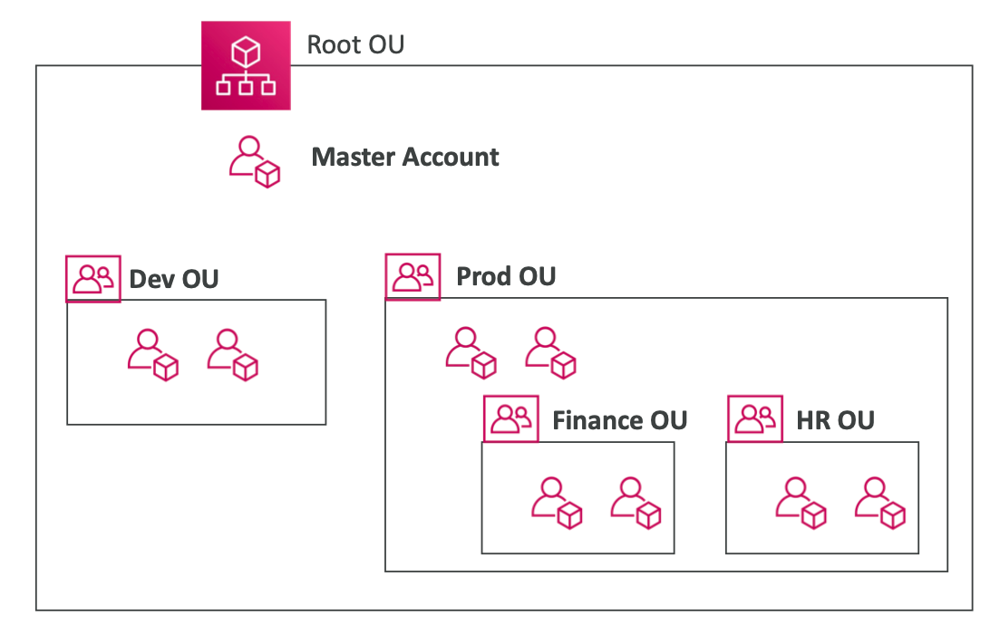
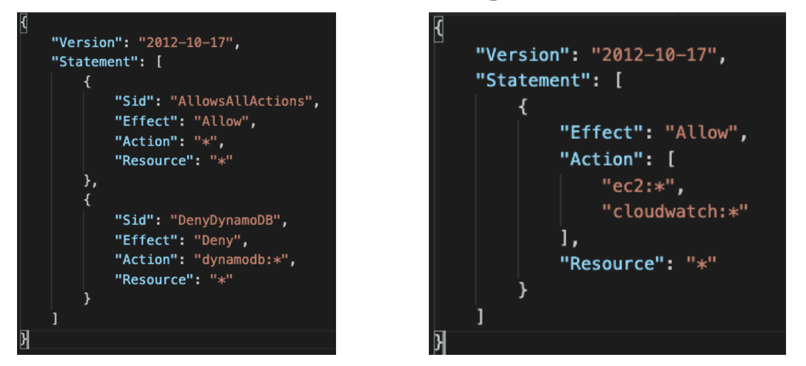
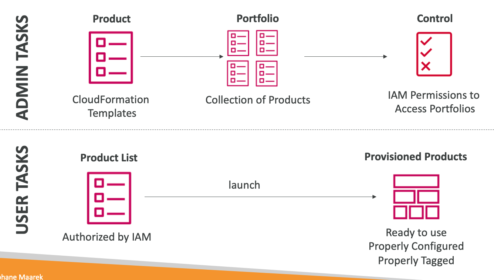

# Section 18. Account Management, Billing & Support

## 1. AWS Organizations

- Allow to manage multiple AWS accounts
- Consolidated billing
- Pricing benefits
- Restrict account privileges using Service Control Policies (SCPs)
- Multi Account Strategies
  - Create accounts per department, per cost center, per dev/test/prod.
  - CloudTrail on all accounts & aggregate logs in central S3 bucket
  - Send CloudWatch Logs to central logging account
- 

## 2. Service Control Policies (SCPs)

- Applied at the OU(organizational unit) or Account level
- Must have an explicit allow, not an explicit deny
- 

## 3. AWS Control Tower

- Easy way to set up and govern a new, secure, multi-account AWS environment
- Automate the set-up of AWS Organizations, AWS accounts, and SCPs
- Detects policy violations
- Automatically sets up AWS Organizations to organize accounts and implement SCPs

## 4. AWS Resource Access Manager (RAM)

- Share AWS resources with any AWS account or within your AWS Organization
- Avoid resource duplication

## 5. AWS Service Catalog

- Create and manage catalogs of IT services that are approved for use on AWS
- IT services are grouped into products, and products are made available through a custom portal
- 

## 6. Pricing Models in AWS

- Pay as you go
- Pay less when you reserve
- Pay less by using more
- Pay even less as AWS grows

## 7. Savings Plan

- Commit to a consistent amount of compute usage (measured in $/hour) for a 1 or 3 year term
- EC2 Savings Plan:
  - Up to 72% discount
  - Commit to a specific instance family in a region (eg. M5)
- Compute Savings Plan:
  - Up to 66% discount
  - Regardless of instance family, size, AZ, OS, tenancy

## 8. AWS Compute Optimizer

- ML-based recommendations to optimize EC2 and Auto Scaling groups
- Helps reduce costs by choosing optimal configurations and right-sizing.

## 9. Billing and Costing Tools

- Estimating costs in the cloud
  - Pricing Calculator
- Tracking costs in the cloud
  - Billing Dashboard
  - Cost Allocation Tags
  - Cost and Usage Reports
  - Cost Explorer
- Monitoring costs in the cloud
  - Billing Alarms
  - Budgets

## 10. Cost Allocation Tags

- Key/value pairs
- Helps track which resources belong to which cost center
- Enable detailed cost reporting

## 11. Cost and Usage Reports

- Most comprehensive set of AWS cost and usage data available
- Enable cost allocation

## 12. Cost Explorer

- Visualize, understand, and manage AWS costs and usage over time
- Analyze costs using dimensions
- Create custom reports and share them with others

## 13. AWS Budgets

- Create budget and send alarms when costs exceed (or forecasted to exceed) the budgeted amount.
- Budget Types:
  - Cost budgets: Monitor how much you spend on AWS
  - Usage budgets: Monitor your usage of one or more AWS services
  - Reservation budgets: Monitor your usage and coverage for AWS Reservations
  - Savings Plan budgets: Monitor your usage and coverage for Savings Plans

## 14. AWS Cost Anomaly Detection

- Detect unexpected cost and usage patterns using ML.
- Receive alerts when anomalies are detected.

## 15. AWS Service Quotas

- View and manage your quotas (limits) for AWS services
- Request increases for quotas or shut down unused resources to stay within the quotas

## 16. Trusted Advisor

- Provides real-time guidance to help you provision your resources following AWS best practices.
- Checks:
  - Cost Optimization
  - Performance
  - Security
  - Fault Tolerance
  - Service Limits

## 17. AWS Support Plans

- Basic: Customer Service, Trusted Advisor, Personal Health Dashboard
- Developer: Business hours email access to cloud support associates
- Business: Full set of Trusted Advisor checks
- Enterprise: Concierge Support Team, TAM (Technical Account Manager)